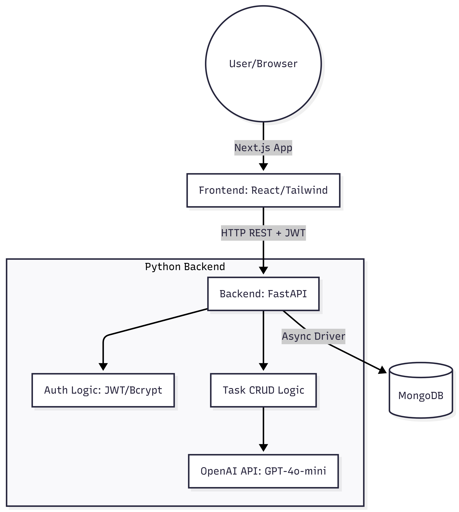

# MiniTasks: Full-Stack Task Manager

An "Exceptional" grade task management application built for the **Orbtronics Ltd** Technical Design Round. This project features a Python (FastAPI) backend, a Next.js frontend, and a MongoDB database.

## 🏗️ System Architecture



*The application follows a modern decoupled architecture:*
1.  **Frontend**: Next.js (React 19) styled with Tailwind CSS, hosted on **Vercel**.
2.  **Backend**: FastAPI (Python 3.11) hosted on **Fly.io**.
3.  **Database**: MongoDB Atlas for flexible cloud storage.
4.  **AI Layer**: **Google Gemini (Flash 1.5)** integration for intelligent due-date suggestions.

## 🚀 Quick Start (Local Docker)

Ensure you have Docker and Docker Desktop installed and running.

1.  **Clone the repository:**
    ```bash
    git clone https://github.com/isidorejad/minitasks.git
    cd minitasks
    ```

2.  **Environment Setup:**
    *   Create `backend/.env` containing:
        ```env
        SECRET_KEY=dev_secret
        MONGO_URL=mongodb://db:27017
        GOOGLE_API_KEY=your_gemini_key_here
        ALLOWED_ORIGINS=http://localhost:3000
        ```
    *   *Note: Frontend environment variables are handled automatically via Docker build args.*

3.  **Launch the Stack:**
    ```bash
    docker-compose up --build
    ```

4.  **Access the App:**
    *   **Web App**: [http://localhost:3000](http://localhost:3000)
    *   **API Docs**: [http://localhost:8000/docs](http://localhost:8000/docs)

## 🧠 AI Implementation & Safeguards
*   **Prompt Engineering**: The prompt is strictly scoped to ask *only* for a date in `YYYY-MM-DD` format based on the description. It forces the model to act as a deterministic date extractor.
*   **Safeguards**:
    1.  **Server-Side Key**: The Google API Key is stored only on the backend (FastAPI) and never exposed to the client.
    2.  **Output Validation**: The API response is strictly parsed; if the AI returns text that isn't a valid date or fails, the system falls back to a randomized "future date" logic to prevent the UI from crashing.
    3.  **Token Limit**: Max output tokens are restricted to prevent verbose injection attacks.

## 🧪 Demo Credentials
You can sign up a new user locally, or use:
*   **Email**: `test@example.com`
*   **Password**: `password123`